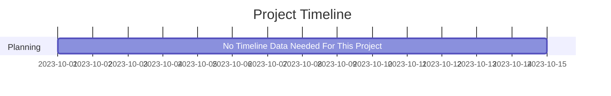

# Statement of Work (SOW)

## 1. Project Title
**[Golang CLI Job Scraper]**  
_A simple command-line application to scrape job / career pages from as many local companies as possible given a ZIP code and radius._

---

## 2. Project Overview

This project is a terminal-based tool designed to search for career/job pages on business websites within a specified radius of a U.S. ZIP code. It helps job seekers, recruiters, or researchers find direct hiring pages quickly, without relying on third-party platforms. In scraping local pages, a job seeker can find opportunities that have been less advertised, potentially leading to less competition and more direct hiring opportunities.

---

## 3. Objectives
Clear, measurable objectives this project aims to achieve.

- Develop a responsive, linux based TUI application.
- Integrate with Yelp and Google Maps APIs for job postings.
- Implement PDF/CSV export functionality for job postings.

---

## 4. Scope of Work

### 4.1 In Scope
Specific features, deliverables, and services to be included:

- TUI development using Go Bubbletea Lipgloss.
- Backend API built in Go with RESTful endpoints.
- Local hosting, ran on machine.
- Unit and integration testing.

### 4.2 Out of Scope
Clarify what will not be covered:

- Mobile native apps.
- Windows/Mac desktop applications.
- Any GUI/UX design beyond Bubbletea / Lipgloss styles.

---

## 5. Deliverables

| Deliverable               | Description                                |
|---------------------------|--------------------------------------------|
| Backend API               | API's from Yelp / Google Maps              |
| Frontend App              | Responsive TUI integrated with backend serv|
| Testing & QA              | Unit and integration test reports          |
| Final Deployment          | Live deployment with CI/CD Pipeline        |

---

## 6. Timeline & Milestones

---

## 7. Assumptions

---

## 8. Constraints

---

## 9. Acceptance Criteria
This project will be considered complete when:
- The TUI application fulfills all deliverables.
- All tests pass the CI pipeline.
- The application is deployed and available for download.
